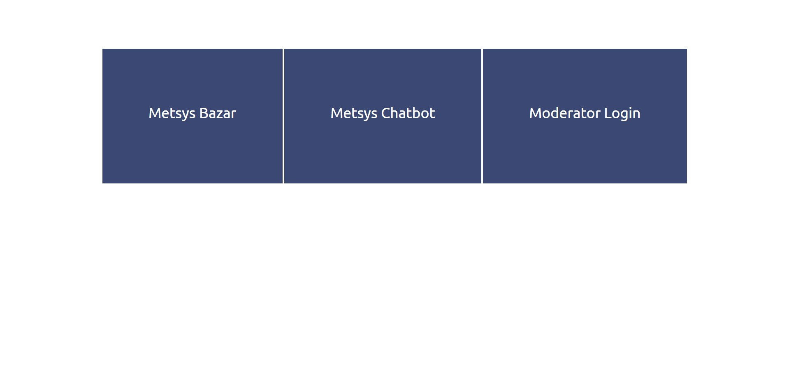
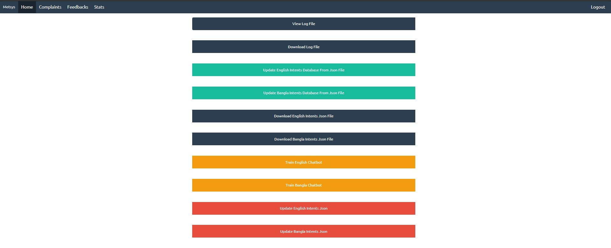
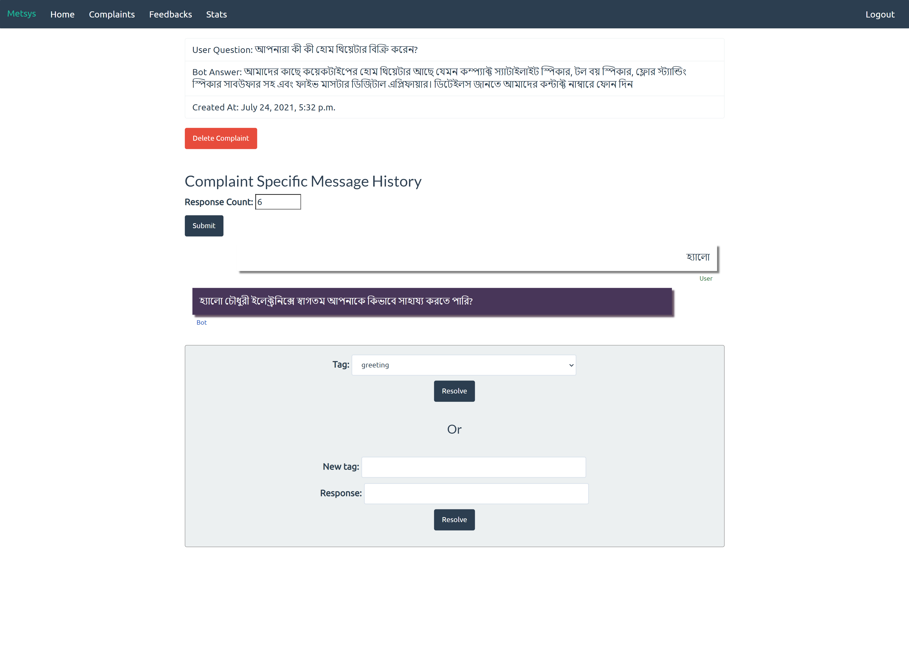

# METSYS - মেত্‌সিস 🤖

This repository contains the work done as part of our Senior Capstone project at North South University. Our team consisted of [Anirudha Paul](https://github.com/anirudha-ani), [Foysal Amin Adnan](https://github.com/adnanfoysal) and [me](https://github.com/AsifulNobel). Based on our findings of this project, we published an article titled [Focused domain contextual AI chatbot framework for resource poor languages](https://doi.org/10.1080/24751839.2018.1558378). The article appeared in Taylor & Francis' Journal of Information and Telecommunication on 2018.

## Motivation

In this day and age, there are lots of online sites that sell goods or services to people. The customers of these sites when faced with a problem, usually try to contact someone from the site such as a customer representative. But this can take awhile based on various circumstances or the site may not even have a customer service. Consequently, the customer becomes unhappy with the site's service and the site may lose the customer.

Chatbots are a scalable, easily deployable and cost-effective solution to this problem in our opinion. We wanted to build a complete solution where a chatbot can be trained, maintained and improved by the business owners. In addition, the chatbot should be able to easily learn a new language despite NLP resource limitations for that language. Our center of attention was the Bangla language.

## Description of the Web Applications

This repo contains two Django web applications - an e-commerce site and a chatbot for the site. *Setup* instructions can be found [here](#how-to-run). When both applications are up and running on port 8000 and 8005 of localhost, we can view the home page with links to the e-commerce site, chatbot and a moderator sign-in page -



If we click on the chatbot link, we will be redirected to a page where we can communicate with the bot. The bot is actually two bots. The two bots have been trained on Bangla and English language separately. Based on language type, messages are passed to the appropriate bot. A sample conversation can be found below -


The `X` buttons beside each bot message lets user mark the message as incorrect so that a human can review the response, take action such as updating pre-defined bot responses and then train the bot on new data. The `Chatbot Known Topics` show the topics that the bot knows for demo and testing purpose. The `Feedback` option let visitors give feedback to our project at the day of the event.

The e-commerce site was created just as a sample, so it's content have not been fully updated for the chatbot's knowledge base. What I mean is that the Chatbot acts as a Customer Representative of an Electronics Shop. But the e-commerce site contains other products too. However, it was enough to present our idea.

The moderator sign-in page lets the e-commerce site admin manage the chatbot after signing in. The view looks like the following -



The moderator can view the chatbot's log files, train the chatbot, update the chatbot's response and view user complaints from here. A user complaint contains the user message, the bot's reply, conversation upto a certain message count limit and option to re-tag the bot's response or add a new response to the bot's knowledge base. A sample detail can be seen below -



## Technology 🔩

We used Python 3.6.2 with [pyenv](https://github.com/pyenv/pyenv) during development. We used TensorFlow to train the bot. We used Django web framework to build the site pages and REST APIs. These can be found in ecommerce-site-with-chatbot directory. We used Django Channels to build real-time communication (WebSockets) interface between user and the bot. The bots can be found in `chatbot-engine/tensor_model` directory. PostgreSQL has been used as database. We also used Cython to improve the Bangla Agent's performance. Other package related information can be found [here](ecommerce-site-with-chatbot/requirements.txt).

## How to Run 🏃

Instructions to get the project up and running can be found [here](ecommerce-site-with-chatbot/setupInstructions.md). After running the project, the following command should be run to update the databases -

```bash
python manage.py migrate
```

Our database dumps have been provided to view some data quickly and login using credentials given [here](ecommerce-site-with-chatbot/superPass.txt). The database dumps can be found inside `ecommerce-site-with-chatbot` directory with `.dump` extension and can be restored using psql.

The applications of this repository have not been hosted anywhere. So, the credentials and `security_key.txt` values are **harmless**. But if anyone is hoping to run it in a publicly accessible server, then please change those for your own good.

## License ⚖️

The work of this repository has been licensed under the the terms of the [Creative Commons Attribution License](http://creativecommons.org/licenses/by/4.0/).

## Citation 🖋️

If you use any work of this repository, please cite the journal article in your work the following way -

```text
Anirudha Paul, Asiful Haque Latif, Foysal Amin Adnan & Rashedur M Rahman (2019) Focused domain contextual AI chatbot framework for resource poor languages, Journal of Information and Telecommunication, 3:2, 248-269, DOI: 10.1080/24751839.2018.1558378
```
